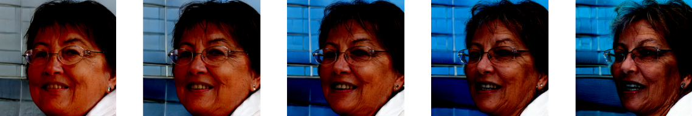
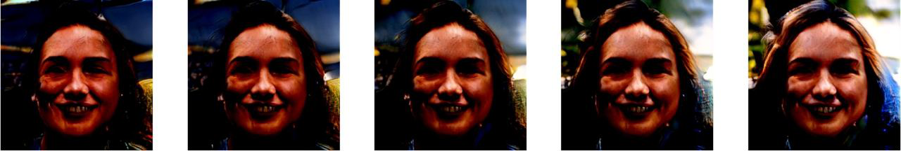
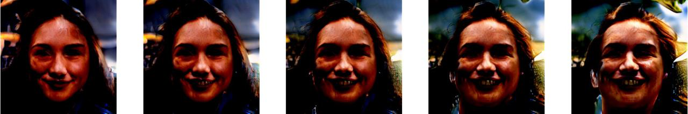

# Exploring Semantic Variations in GAN Latent Spaces via Matrix Factorization
Authors official implementation of the [Exploring Semantic Variations in GAN Latent Spaces via Matrix Factorization](https://openreview.net/forum?id=2Z-dQTRezZ) (ICLR 2023 Tiny Papers).

> **Exploring Semantic Variations in GAN Latent Spaces via Matrix Factorization**<br>
> Andrey Palaev<sup>1</sup>, Rustam A. Lukmanov<sup>1</sup>, Adil Khan<sup>1,2</sup><br>
> <sup>1</sup>Innopolis University, <sup>2</sup>Schaffhausen Institute of Technology<br>
>
> <p align="justify"><b>Abstract:</b> <i>Controlled data generation with GANs is desirable but challenging due to the nonlinearity and high dimensionality of their latent spaces. In this work, we explore image manipulations learned by GANSpace, a state-of-the-art method based on PCA. Through quantitative and qualitative assessments we show: (a) GANSpace produces a wide range of high-quality image manipulations, but they can be highly entangled, limiting potential use cases; (b) Replacing PCA with ICA improves the quality and disentanglement of manipulations; (c) The quality of the generated images can be sensitive to the size of GANs, but regardless of their complexity, fundamental controlling directions can be observed in their latent spaces.</i></p>

## Installation
```pip install -r requirements.txt```

## Results
StyleGAN2 (100 components) - weight


StyleGAN2 (100 components) - brightness


[FastGAN](https://arxiv.org/abs/2101.04775) (1000 compnents) - background


[FastGAN](https://arxiv.org/abs/2101.04775) (1000 compnents) - age+smile


## Citation
```
@misc{
palaev2023exploring,
title={Exploring Semantic Variations in {GAN} Latent Spaces via Matrix Factorization},
author={Andrey Palaev and Rustam A. Lukmanov and Adil Khan},
year={2023},
url={https://openreview.net/forum?id=2Z-dQTRezZ}
}
```

## Credits
For StyleGAN2, we used the official PyTorch implementation from NVIDIA: https://github.com/NVlabs/stylegan2-ada-pytorch
For FastGAN, we used the official PyTorch implementation: https://github.com/odegeasslbc/FastGAN-pytorch
